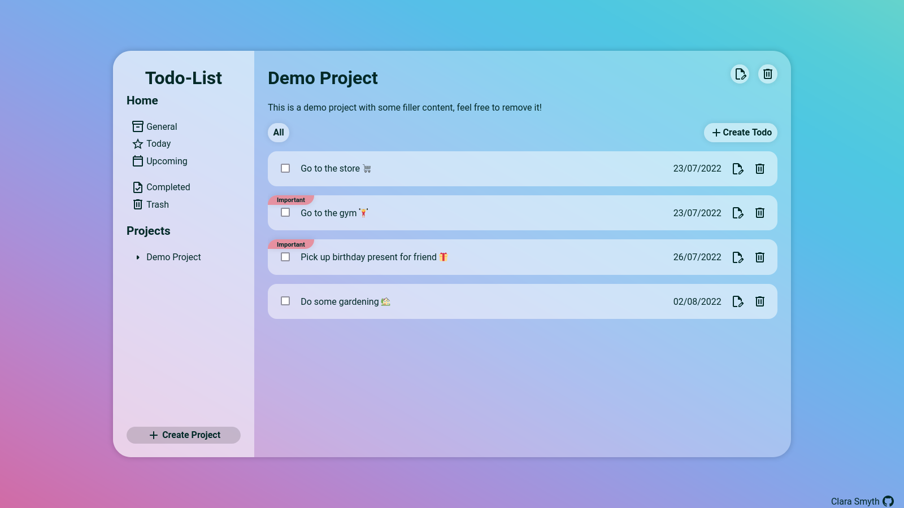
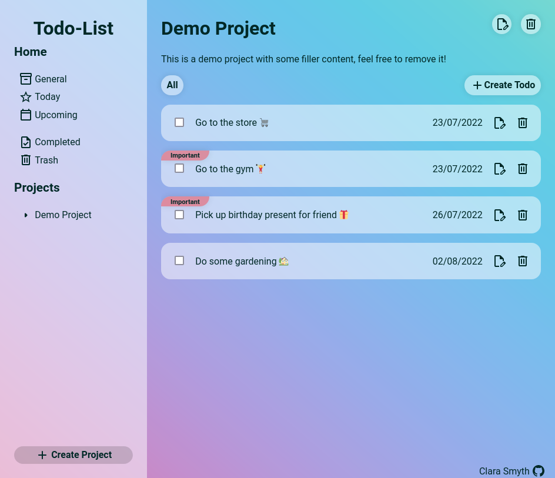
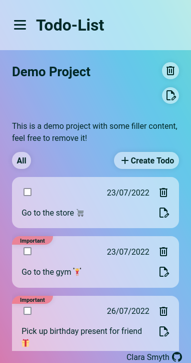

	<h1>Todo-List Application
	 
		
		
		
		
		 
	</h1>

## Description

This is a todo list application created as part of [TheOdinProject](https://www.theodinproject.com) curriculum.

To see the assignment details - [Click Here](https://www.theodinproject.com/lessons/node-path-javascript-todo-list)

## Built Using

-   HTML5 
-   CSS3 
-   JavaScript 
-   Webpack 

## Credits

#### JavaScript Libraries

-   [date-fns](https://date-fns.org/)

#### Icons

-   [Google Material Icons](https://fonts.google.com/icons?icon.set=Material+Icons)
-   [Microsoft Fluent UI System Icons](https://github.com/microsoft/fluentui-system-icons)

## Gallery

#### Desktop view

#### Tablet view

#### Mobile view

# Todo-List
